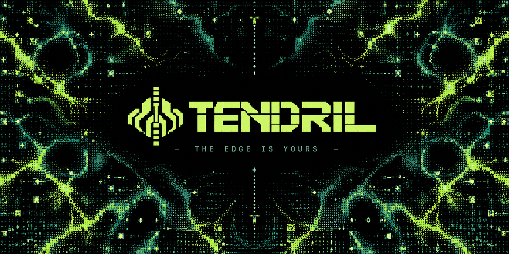

[](#host-installation) [](#host-installation) [](docs/ANDROID.md) [](https://herdr.dev) [](#what-it-does) [](#how-it-works) [](#what-it-does) [](https://github.com/Ozymandes/TENDRIL/tree/v0.1.1) [](LICENSE)

TENDRIL puts a small, direct control surface for persistent AI-agent sessions
in your pocket. From Android, check the live workspaces on a Linux workstation,
move to the session you need, and leave the host to keep working when you put
the phone away.

## Why TENDRIL exists

Long-running work deserves a connection that can come and go. I wanted to
check on a living little agent lab from my phone: see what's running, switch
to the right workspace, and steer it without hauling the workstation around.
There is a particular pleasure in doing that over the first cup of Earl Grey,
before the morning has quite started.

I admired the polish of tools like Moshi, then found that some of the features
I most wanted were behind a paywall. I took that as a design prompt. TENDRIL
is my own small, MIT-licensed system, shaped around the balance of beauty,
control, simplicity, and openness I wanted from the start.

## What it does

- `tendril` connects from Termux to your Linux host, preferring Mosh and falling
  back to SSH.
- `remote-agents` presents Herdr's live workspaces in a terminal selector. Pick
  a workspace to attach, create one, open a project, or check host status.
- `herdr-notify` can watch session state and send an ntfy alert when work
  finishes or an agent needs input.

The agents run in Herdr on the workstation. The phone joins their sessions; it
does not host them. Your work survives a dropped connection, a closed terminal,
and the walk to the kettle.

## How it works

```text
ANDROID / TERMUX                         LINUX WORKSTATION
`tendril` ── Tailscale ── Mosh / SSH ──> Herdr
                                           └─ `remote-agents` TUI
                                                ├─ Pi / Claude Code / Codex
                                                └─ persistent workspaces

                                           `herdr-notify` ── ntfy ──> Android
```

Herdr owns the persistent sessions. TENDRIL supplies the mobile launcher and
workspace switchboard; the optional notifier reports meaningful state changes.
The console and watcher use Herdr's live snapshot, and the host install stays
user-local with Python's standard library.

## Quick start

### Host installation

On Linux, install Herdr first, then clone TENDRIL and run its interactive
installer. It checks compatibility, previews changes with `--dry-run`, and
never uses `sudo`.

```sh
git clone https://github.com/Ozymandes/TENDRIL.git
cd TENDRIL
./install --doctor
./install
```

### Android / Termux

Install OpenSSH and Mosh, configure an SSH host alias, and add the phone's key
to the host. The [Android guide](docs/ANDROID.md) walks through pairing and
copies both canonical launchers from the host checkout into `~/bin`.

```sh
pkg update && pkg install openssh mosh
ssh-keygen -t ed25519 -f ~/.ssh/id_ed25519 -N "" -C termux
ssh-copy-id <host-alias>
tendril
```

## Why it feels different

A terminal tool can be beautiful and still be precise. TENDRIL keeps the
interface close to the work: legible at phone width, quick to navigate, and
free of a dashboard layer between you and the sessions. The name fits that
shape. A tendril reaches into a larger living system and gives you a thread
back to it. The engineering stays thin; the tool still gets to have a point
of view.

## Commands and compatibility

`tendril` is the official phone command. Install `phone/tendril` as
`~/bin/tendril`. `phone/agent` remains a real wrapper for existing installs of
`agent`; it is supported for backwards compatibility. The older
`AGENT_ALIAS` setting also continues to work.

In the selector, use ↑/↓ to highlight a workspace and Enter to attach; typing
its number followed by Enter still works, including multi-digit numbers.
`Alt+D` detaches back to the menu: on the phone, tap ALT then D.
`Ctrl+B` then `D` is the fallback. Detaching leaves workspaces and agents running.
The installer preserves existing bindings and only adds conflict-free shortcuts.
`Ctrl+Home` is optional on Herdr versions that accept it; Herdr 0.9.3 does not.
Inside a workspace, `Ctrl+B 1..9` jumps to a workspace, `Ctrl+B w` opens the
picker, and `Ctrl+B n`/`p` cycles tabs. `N`, `P`, `S`, and `I` open the
new-workspace, project, shell, and host-status flows. See the [Android guide](docs/ANDROID.md)
for Termux key behavior and setup details.

## Further reading

- [Android / Termux setup](docs/ANDROID.md)
- [Architecture](docs/ARCHITECTURE.md)
- [Security model](docs/SECURITY.md)
- [License](LICENSE)

Run `./install --doctor` for a read-only host check. Run `./uninstall` to remove
TENDRIL's installed files; it asks before removing your configuration.
